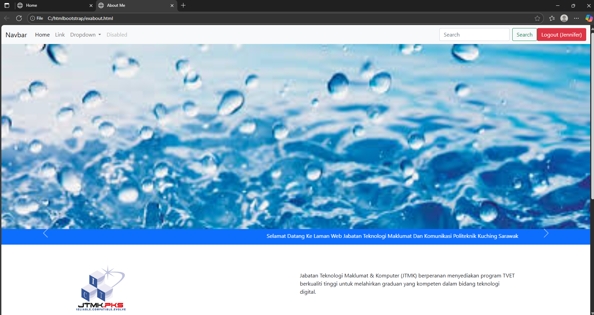

# Mini Profile Test
The barebones of mini project for self-introduction website.

## Overview
Made to learn how to create a simple website by using readymade functionable code such as Bootstrap.

## Features
- navigation bar to go around the website
- moving carousel for photos
- log in 

## Technologies Used
- HTML, CSS, JS
- Bootstrap
- ChatGPT

## Screenshot

## Installation
1. Clone this repository
2. Open in VS Code
3. Run using Live Server

## Contributors
- Name: [Jennifer Anne Anak Nou]
- Course: [DFK20013 WEB DESIGN TECHNOLOGY]
- Institution: Politeknik Kuching Sarawak
